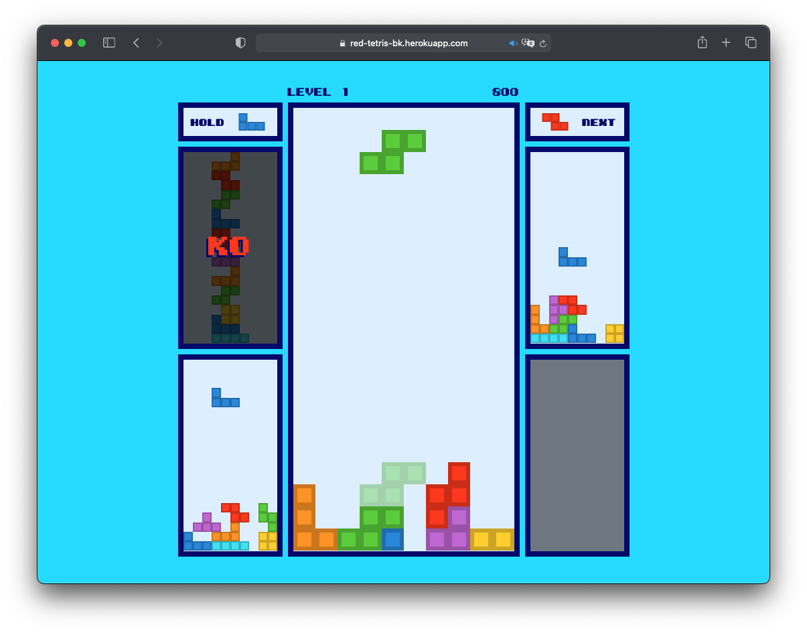
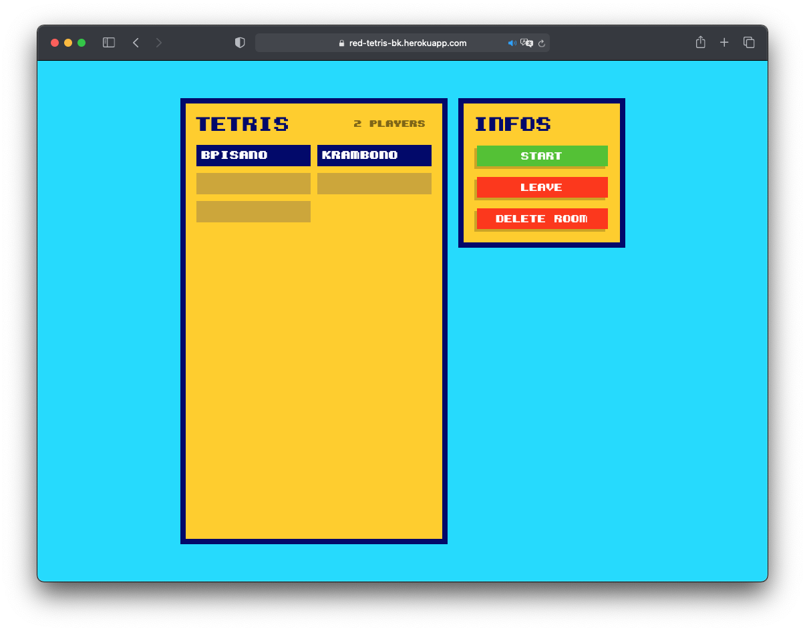
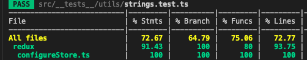
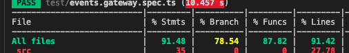

# Red Tetris




## Introduction

Red Tetris is a single and multiplayer Tetris game project at the 42 school. Players can create rooms to invite their friends to play Tetris. Players can send garbage lines to their opponent as they destroy their own ones. The last player to survive is the winner of the game.

## Installation

You can install Red Tetris very easily by following these steps:

1. Clone the repository:

```bash
git clone https://github.com/knona/red-tetris
```

2. At the project root, run the following command to start it:

```bash
npm start
```

3. Use Red Tetris with your web browser using this url: `localhost:5000`

## How to play

1. Create your username and click `Play`.
2. Create a room by clicking `New` and choose its name. You can invite your friends to play by sharing them the url. But you can also play solo.
3. Click `Start` to start the game.

Here are the Tetris commands:

| Keys               | Action                 |
| ------------------ | ---------------------- |
| <kbd>&#8593;</kbd> | Rotate the piece right |
| <kbd>&#8592;</kbd> | Move the piece left    |
| <kbd>&#8594;</kbd> | Move the piece right   |
| <kbd>&#8595;</kbd> | Move the piece down    |
| <kbd>Space</kbd>   | Hard drop the piece    |
| <kbd>Ctrl</kbd>    | Rotate the piece left  |
| <kbd>z</kbd>       | Rotate the piece left  |
| <kbd>Shift</kbd>   | Hold the piece         |
| <kbd>c</kbd>       | Hold the piece         |

## Technologies

This project is made entirely using [Typescript](https://www.typescriptlang.org) which dramatically improves Javascript.

The subject of the project require that the frontend should be made using functional programming. We've choosen to use [React Hooks](https://fr.reactjs.org/docs/hooks-intro.html) which is perfectly adapted for this case. It also uses [Redux](https://redux.js.org) for the data management and take advantage of the [Redux Toolkit](https://redux-toolkit.js.org) library that improves Redux. Finally, we've decided to include [RxJS](https://rxjs-dev.firebaseapp.com) to take advantage of its powerful observable pattern.

The backend part is made using Object Oriented Programing. It is made using [NestJS](https://nestjs.com) that made events handling from the frontend very easy. It only uses [socket.io](https://socket.io) to communicate with the frontend.

## Features

Red Tetris comes with the following features.

### UI

- Carefully crafted user interface.
- Vibrant colors and intuitive user interface.

### Multiplayer

- Create rooms and invite your friends to play tetris.
- Join a room by simply sharing the url.
- Compare your position with the others players with the leaderboard.

### Tetris

- Play with the [perfectly replicated gameplay](https://tetris.fandom.com/wiki/Tetris_Guideline) from the original Tetris game.
- Send garbage lines to your opponents as you destroy your own.
- Try to destroy garbage lines with their single hole.
- Watch the speed of the tetrominos increasing the longer you survive.
- Take advantage of the playfield buffer to save you from a game over.
- Take advantage of the tetromino lock system to make the perfect move.
- Hold a tetromino to use it later.

## Tests

The subject of the project require that:

- At least 70% of the statements, functions and lines should be covered by tests.
- At least 50% of the branches should be covered by tests.

In both the frontend and backend tests, we are using `Jest`.

To run the tests, use the following command at the root of the `client` or `server` directory:

```bash
npm run test:cov
```

### Client results



### Server results


